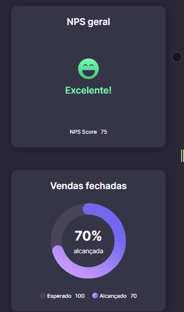

<h1 align="center"> Projeto #boracodar </h1>

Este é um projeto de Dashboard. A página inclui gráficos do tipo dunts e barras.  

  <a href="#-tecnologias">Tecnologias</a>&nbsp;&nbsp;&nbsp;|&nbsp;&nbsp;&nbsp;
  <a href="#-projeto">Projeto</a>&nbsp;&nbsp;&nbsp;|&nbsp;&nbsp;&nbsp;
  <a href="#-layout">Layout</a>&nbsp;&nbsp;&nbsp;|&nbsp;&nbsp;&nbsp;
  <a href="#memo-licença">Licença</a>

  

 

  

 

  

 

## 🚀 Tecnologias

Esse projeto foi desenvolvido com as seguintes tecnologias:

 
  <!-- &nbsp; &nbsp; &nbsp; &nbsp; -->
  &nbsp; &nbsp; &nbsp; &nbsp;
  &nbsp; &nbsp; &nbsp; &nbsp; 
&nbsp; &nbsp; &nbsp; &nbsp;
  
&nbsp; &nbsp; &nbsp; &nbsp;

 

   

## 💻 Projeto

Um dashboard totalmente animado .

 [Visite o projeto online](https://github.com/JacqueNunes/cartao-de-embarque)

## 🔖 Layout

Você pode visualizar o layout do projeto através [DESSE LINK](https://jacquenunes.github.io/cartao-de-embarque/).

## :memo: Licença

Esse projeto está sob a licença MIT. 

---

<table>
  <tr>
    <td>
      
    </td>
    <td>
      
    </td>
    <td>
      Feito por <a href="https://github.com/JacqueNunes">Jacqueline Nunes.</a>
        Junto com a <a href="https://rocketseat.com.br">Rocketseat</a> 
    </td>
  </tr>
</table>